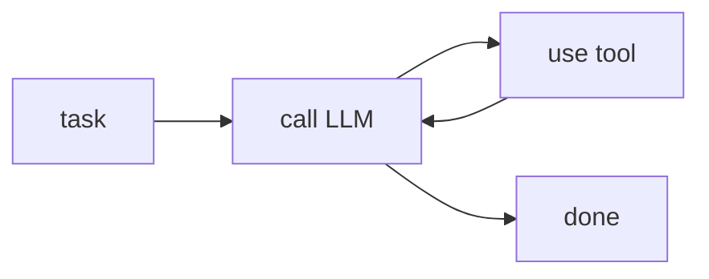
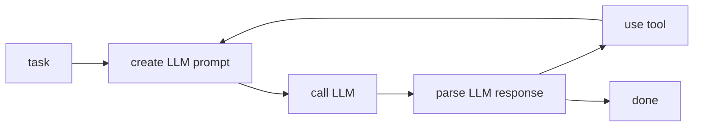

# Agents

## What is an agent?

An agent flexibly solves a user's task by using large language models (LLM), memory (embeddings), and tools (e.g., search, analyzing data, etc.).

A basic agent works like this:

The critical piece is that **the language model response determines what tool to use**.
This enables the agent to be flexible and solve a wide variety of tasks.

Calling the LLM requires creating a prompt and parsing its response.
Here is the same diagram with a bit more detail:

There are other variants of agents that are much more complex and involve self-calls, planning, memory, and more.

## Agent composition

Agents add several new concepts like steps, tools, and runs. You can learn more in the [agent tutorials](/tutorial/wikipedia-agent).
