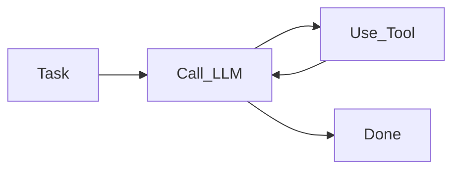
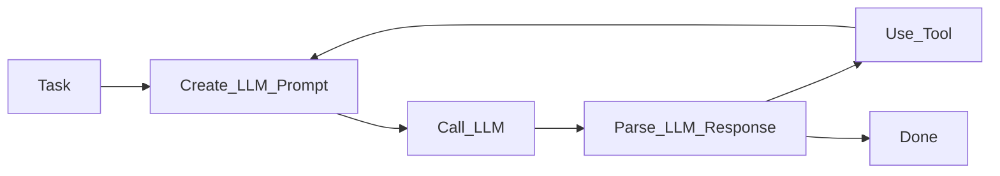

# Getting Started

Let's discover **JS Agent in less than 5 minutes**.

## What is an agent?

An agent flexibly solves a user's task by using large language models (LLM), memory (embeddings), and tools (e.g., search, analyzing data, etc.).

A basic agent works like this:



The critical piece is that **the language model response determines what tool to use**.
This enables the agent to be flexible and solve a wide variety of tasks.

Calling the LLM requires creating a prompt and parsing its response.
Here is the same diagram with a bit more detail:



There are other variants of agents that are much more complex and involve self-calls, planning, memory, and more.

## JS Agent

JS Agent is a composable and extensible framework for creating agents with JavaScript and TypeScript.

While creating an agent prototype is easy, increasing its reliability and robustness is complex and requires considerable experimentation.
JS Agent provides robust building blocks and tooling to help you develop rock-solid agents faster.

**JS Agent is currently in its initial experimental phase. Before reaching version 0.1, there may breaking changes in each release.**

## Installing JS Agent

```bash
npm install js-agent
```

### What you'll need

- [Node.js](https://nodejs.org/en/download/) version 18 or above
- [OpenAI API access](https://platform.openai.com/overview)
  - We'll add support for other model providers.
