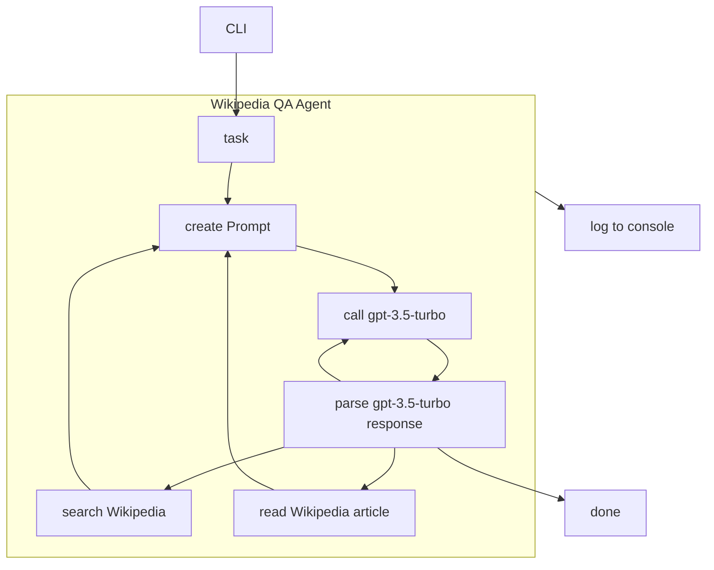

# Overview

In this tutorial, we'll create an agent that answers questions by searching and reading [Wikipedia](https://www.wikipedia.org/) articles.
You can find the complete code in the [Wikipedia agent example](https://github.com/lgrammel/js-agent/tree/main/examples/wikipedia).

The agent will use the following components:

- OpenAI `gpt-3.5-turbo` chat completion model
- A loop in which the agent determines and executes steps ("GenerateNextStepLoop")
- A custom prompt
- Wikipedia search tool (implemented using a [Programmable Search Engine](https://programmablesearchengine.google.com/))
- Wikipedia article reading tool
- Command line interface and console logger that shows the agent's progress

This is the high-level flow of the agent:

